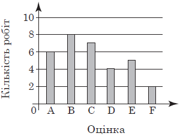

# Тренажер НМТ — Теорія ймовірностей

Інтерактивний вебзасіб для підготовки до НМТ з математики.  
**Тема 37: Основи теорії ймовірностей та математичної статистики**

🔗 **Тренажер:** https://pastushak.github.io/probability-trainer/  
📖 **Конспект:** https://pastushak.github.io/probability-trainer/konspekt.html

---

## Можливості

| Вкладка | Що містить |
|---|---|
| **Тренажер задач** | 43+ задачі у форматі НМТ/ЗНО з покроковим розв'язанням і підказками |
| **Симуляції** | Монетка, кубик, кульки в урні — закон великих чисел наочно |
| **Діаграми Венна** | Інтерактивні діаграми Ейлера–Венна: A∩B, A∪B, Ā, A\B тощо |
| **Статистика** | Калькулятор: введи числа → мода, медіана, середнє, розмах, ряд розподілу |
| **Формули** | Всі ключові формули теми в одному місці |
| **Конспект** | Окрема сторінка з теорією, прикладами та алгоритмом розв'язання |

---

## Типи задач у тренажері

- Класична ймовірність: P = m/n
- Геометрична ймовірність: P = Sₐ/SΩ
- Теорема додавання (несумісні та сумісні події)
- Теорема множення (незалежні та залежні події, умовна ймовірність)
- «Хоча б одна» з n незалежних подій
- Статистика: мода, медіана, середнє, розмах
- Задачі з діаграмами та графіками (з зображеннями)

---

## Структура проєкту

```
probability-trainer/
├── index.html          # Головна сторінка — тренажер
├── konspekt.html       # Конспект з теорії ймовірностей
├── css/
│   └── style.css       # Стилі тренажера
├── js/
│   ├── app.js          # Ініціалізація та навігація
│   ├── quiz.js         # Логіка тренажера задач
│   ├── simulate.js     # Симуляції (монетка, кубик, кульки)
│   ├── venn.js         # Діаграми Венна
│   └── stats.js        # Статистичний калькулятор
├── data/
│   ├── questions.js    # База задач (легко доповнювати)
│   └── formulas.js     # База формул
└── img/
    └── *.png           # Зображення до задач із zno.osvita.ua
```

---

## Як додати нову задачу

Відкрий `data/questions.js` і додай об'єкт у масив `QUESTIONS`:

```js
{
  type: 'classic',         // classic | add | mult | atleast | stat
  tag: 'tag-classic',      // CSS клас для кольорового бейджа
  tagLabel: 'Класична ймовірність',
  text: 'Умова задачі...',
  choices: ['0,1', '0,2', '0,3', '0,4', '0,5'],
  answer: 1,               // індекс правильної відповіді (0-based)
  solution: 'Покрокове розв\'язання...',
  hint: 'Підказка для учня...'
}
```

Для задачі з картинкою додай `` у поле `text`:

```js
text: `Умова задачі...
`,
```

---

## Технології

- Чистий HTML / CSS / JS — без фреймворків
- [Chart.js](https://www.chartjs.org/) — графіки симуляцій
- [MathJax](https://www.mathjax.org/) — математичні формули в конспекті
- Готовий до розміщення на GitHub Pages (статичний сайт)

---

## Автор

Роман Пастушак · Коломийська гімназія імені Михайла Грушевського